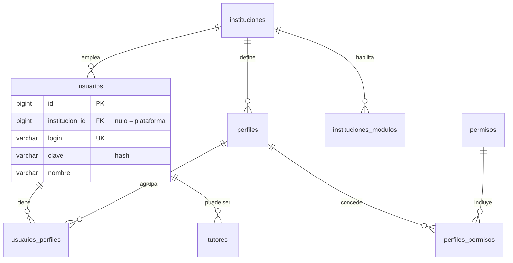

# Acceso y usuarios

Los usuarios que inician sesión se guardan en PostgreSQL, en la tabla `usuarios`. La contraseña no va en claro: el campo `clave` guarda el hash. El administrador de plataforma queda con `institucion_id` nulo; el de una escuela apunta a `instituciones`.

Al primer arranque, si la tabla está vacía, se inserta un usuario con login `admin`, nombre «Administrador de plataforma» y sin escuela. Ese usuario publica los planes y el calendario oficial de la SEP. Otro usuario, login `super` y clave `super`, también sin escuela, administra el acceso: CCT, plantel, módulos, perfiles y vigencia. No publica planes. MongoDB no guarda usuarios; solo los PDF en GridFS.

## Convención de nombres

| Qué | Forma | Ejemplo |
|---|---|---|
| Tabla | Plural, `snake_case` | `usuarios` |
| Clase de entidad | Singular. Representa un registro | `Usuario` |
| Columna de llave foránea | Singular. Apunta a un registro | `usuario_id` |
| Tabla de relación | Plural de ambos lados | `usuarios_perfiles` |

La migración `V10__nombres_en_plural.sql` renombra las tablas ya creadas. Las migraciones anteriores no se reescriben: Flyway ya les calculó el checksum.

## Dónde queda cada cosa del acceso

| Tabla | Qué guarda |
|---|---|
| `usuarios` | Quién entra: login, hash de la clave y nombre |
| `instituciones` | La escuela. Si `usuarios.institucion_id` es nulo, es administrador de plataforma |
| `perfiles` | Un rol de la escuela (por ejemplo capturista) |
| `usuarios_perfiles` | Qué perfiles tiene cada usuario |
| `permisos` | El código de la operación (`ALUMNOS_CAPTURAR`, `PADRES_CONSULTAR`, …) |
| `perfiles_permisos` | Qué permisos incluye cada perfil |
| `instituciones_modulos` | Qué módulos están encendidos en esa escuela |
| `tutores` | El tutor. Si tiene cuenta, `usuario_id` apunta a `usuarios` |

## Diagrama de acceso

## Diccionario de `usuarios`

Creada en `V2__acceso.sql` y renombrada en `V10__nombres_en_plural.sql`. La clase Java es `Usuario`.

| Columna | Tipo | Regla |
|---|---|---|
| `id` | `bigint` | Identificador. Lo genera la base |
| `institucion_id` | `bigint` | Escuela. Nulo solo en el administrador de plataforma. Referencia a `instituciones(id)` |
| `login` | `varchar(80)` | Usuario de entrada. Único en toda la base. Obligatorio |
| `clave` | `varchar(120)` | Hash de la contraseña. Es lo que usa Spring Security. Obligatorio |
| `nombre` | `varchar(160)` | Nombre para mostrar. Obligatorio |

## Tablas ligadas

### `usuarios_perfiles`

Solo tiene `usuario_id` y `perfil_id`, ambos obligatorios, y juntos forman la llave. Un usuario puede tener varios perfiles y un perfil varios usuarios.

| Columna | Tipo | Regla |
|---|---|---|
| `usuario_id` | `bigint` | Referencia a `usuarios(id)`. Parte de la llave primaria |
| `perfil_id` | `bigint` | Referencia a `perfiles(id)`. Parte de la llave primaria |

### `perfiles`

| Columna | Tipo | Regla |
|---|---|---|
| `id` | `bigint` | Identificador. Lo genera la base |
| `institucion_id` | `bigint` | Escuela dueña del perfil. Referencia a `instituciones(id)` |
| `nombre` | `varchar(80)` | Nombre del perfil. Obligatorio |

### `permisos`

| Columna | Tipo | Regla |
|---|---|---|
| `id` | `bigint` | Identificador. Lo genera la base |
| `codigo` | `varchar(60)` | Código de la operación. Único y obligatorio |

Los códigos iniciales están en `V9__permisos.sql`: `PLANTILLA_CONSULTAR`, `PLANTILLA_CAPTURAR`, `ALUMNOS_CONSULTAR`, `ALUMNOS_CAPTURAR`, `PLANES_CONSULTAR`, `PLANES_CONFIGURAR`, `PLANES_CERRAR`, `INSCRIPCION_CONSULTAR`, `INSCRIPCION_CAPTURAR`, `EVALUACION_CONSULTAR`, `EVALUACION_CAPTURAR`, `DOCUMENTOS_CONSULTAR`, `DOCUMENTOS_EMITIR`, `PADRES_CONSULTAR`.

`V13` agrega `DICTAMEN_CONSULTAR` y `DICTAMEN_CAPTURAR`, del módulo de inscripción. Un perfil que ya tenía `INSCRIPCION_CAPTURAR` los recibe. El calendario y el esquema de evaluación usan `PLANES_CONFIGURAR` y `PLANES_CERRAR`.

### `perfiles_permisos`

| Columna | Tipo | Regla |
|---|---|---|
| `perfil_id` | `bigint` | Referencia a `perfiles(id)`. Parte de la llave primaria |
| `permiso_id` | `bigint` | Referencia a `permisos(id)`. Parte de la llave primaria |

### `tutores`

La ficha del tutor vive en `tutores` (`V5__alumnos.sql`, renombrada en `V10`). La cuenta de acceso, si existe, sigue estando en `usuarios`.

| Columna | Tipo | Regla |
|---|---|---|
| `id` | `bigint` | Identificador. Lo genera la base |
| `institucion_id` | `bigint` | Escuela. Obligatorio. Referencia a `instituciones(id)` |
| `nombre` | `varchar(160)` | Nombre del tutor. Obligatorio |
| `usuario_id` | `bigint` | Cuenta de acceso. Opcional. Referencia a `usuarios(id)` |

El resto del modelo (planes, grupos, alumnos, calificaciones, asistencia, documentos, avisos y auditoría) cuelga de `instituciones` y de `alumnos`, no de `usuarios`.
